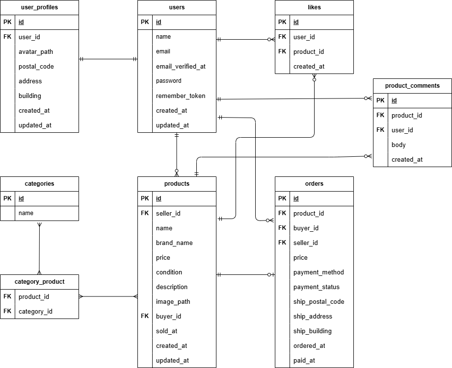

# フリマアプリ

## 環境構築

### Docker ビルド

1. Dockerを起動する
2. `git clone git@github.com:seki0603/flea-market.git`
3. cd flea-market
4. mkdir docker/mysql/data
5. docker-compose up -d --build

＊MySQL は、OS によって起動しない場合があるのでそれぞれの PC に合わせて docker-compose.yml ファイルを編集してください。
<br>

### Laravel 環境構築

1. docker-compose exec php bash
2. composer install
3. cp .env.example .env
4. php artisan key:generate
5. php artisan migrate
6. php artisan storage:link
7. chmod -R 777 storage bootstrap/cache
8. php artisan db:seed

* .env.exampleの値はダミー値です。そのまま利用可能ですが、必要に応じて.envで設定し直してください。
   <br>

## Stripe 接続

.env 及び.env.testing に Stripe テストキーを記載してください。  
実際のテストキーは案件シートの基本設計書ページ最下部に記載しています。  
案件シートへは README 最下部記載の URL からアクセス可能です。

```
公開キー（STRIPE_KEY）: pk_test_xxxxx...
シークレットキー（STRIPE_SECRET）: sk_test_xxxxx...
```

<br>

## メール認証機能について

MailHog にて実装しています。  
.env.exampleにて必要項目を設定しているため、Docker起動後はhttp://localhost:8025 にて受信確認可能です。
<br>

## 動作確認について
ダミーデータにてユーザー3名が作成されます。
ログイン情報は下記の通りです。
```
Email: test{$index}@example.com
Password: password123
※{$index}には1 ~ 3の数字が入ります。
```
## 使用技術

- PHP 8.1.3
- Laravel 8.83.29
- MySQL 8.0.26
- nginx 1.21.1
  <br>

## テスト実行方法
プロジェクトディレクトリ直下で実行してください。

1. docker-compose exec mysql bash
2. mysql -u root -p
3. パスワードはrootと入力
4. CREATE DATABASE laravel_test;
5. MySQL コンテナから抜ける
6. docker-compose exec php bash
7. php artisan key:generate --env=testing
8. vendor/bin/phpunit
   <br>

## ER 図



## 補足事項
### ダミーデータについて

本アプリケーションでは、案件シートで指定された商品データを基準に Seeder を作成しています。
出品者・購入者・コメント・いいね等の関連データは、UIおよび機能確認を容易にするために一部自動生成で補完しています。
これにより、要件上の「商品情報」「カテゴリ情報」「ユーザー情報」を再現しつつ、実際の運用に近いデータ構成を確認できます。

※ 確認用の水増しデータを投入したい場合は、DatabaseSeeder.php 内の DummyProductsSeeder::class のコメントアウトを外してください。

<br>


### 検索機能について

案件シート上では検索ボタン押下操作が指定されていた一方、Figma では入力欄のみがデザインされていました。
そのため、要件意図を優先して検索ボタンを実装しています。
リセットボタンの指定はなかったため未実装ですが、検索欄を空にした状態で再検索することで一覧をリセットできる仕様としています。

<br>

### Stripe(決済機能)について

模擬案件要件に沿って Stripe のサンドボックス環境を利用しています。
実際の決済は行われず、支払い操作完了後は一覧画面にて Sold 表示とフラッシュメッセージで購入完了を確認できます。

* カード支払いでは Stripe テスト用カード情報を利用可能です。
```
カード番号 : 4242 4242 4242 4242
有効期限 : 未来の月/年　（例: 12/30）
CVC : 任意の3桁の数字　（例: 123）
```

<br>

- コンビニ支払いは Stripe の仕様に従い、登録後に支払い画面に遷移せず、一覧画面にて反映を確認できます。F

<br>

### メール認証機能について

MailHog を使用して実装しています。
案件シートでは「認証誘導画面 → 認証画面」の遷移が指定されていましたが、
Figma で認証画面のデザイン指定がなかったため、参考UIの意図に沿って自作デザインを補完しています。
また、メール認証が完了している場合は、認証誘導画面をスキップしてプロフィール設定画面へ自動遷移する仕様としています。

## URL

- 開発環境：http://localhost/
- phpMyAdmin：http://localhost:8080/
- MailHog : http://localhost:8025/
- 案件シート : https://docs.google.com/spreadsheets/d/1zicFKHZg867c-sDSzqEwH6PBJuir5okUgYe7ncBSdtM/edit?gid=1113232830#gid=1113232830
