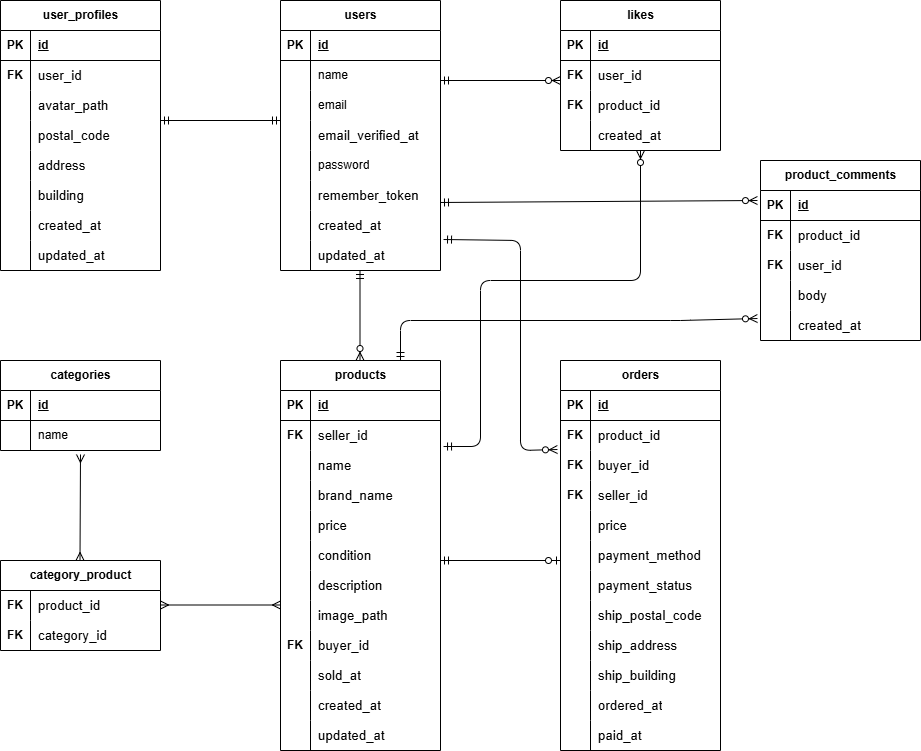

# フリマアプリ

## 環境構築

### Docker ビルド

1. `git clone git@github.com:seki0603/flea-market.git`
2. cd flea-market
3. mkdir docker/mysql/data
4. docker-compose up -d --build

＊MySQL は、OS によって起動しない場合があるのでそれぞれの PC に合わせて docker-compose.yml ファイルを編集してください。
<br>

### Laravel 環境構築

1. docker-compose exec php bash
2. composer install
3. .env.example ファイルから.env を作成し、環境変数を変更
4. php artisan key:generate
5. php artisan migrate
6. php artisan storage:link
7. php artisan db:seed
   <br>

## 使用技術

- PHP 8.1.3
- Laravel 8.83.29
- MySQL 8.0.26
- nginx 1.21.1
  <br>

## ER 図



## 補足事項

### ダミーデータについて

デフォルトでは下記のデータが投入されます。

- ユーザー 3 名
- ユーザー 3 名分のプロフィール
- Figma にて指定された商品カテゴリー 14 種類
- 案件シートにて指定された商品データ
  - 出品者はダミーユーザー 3 名に振り分け
  - コメントを各商品に 1~2 件作成
  - ユーザー毎に「いいね」を 5 件ずつ作成
  - ユーザー毎に 2 件ずつ、指定された商品データの中から購入商品を設定

<br>
また、機能やUIの確認を容易にするために水増しデータを作成しています。<br>
お使いになる際は、DatabaseSeeder.phpのDummyProductsSeeder::classに対するコメントアウトを外してください。

<br>
テストの実行に関し、テスト用のシーダーを作成していますが、<br>
テストコードにて直接引用しているため、特別な操作は必要なくテスト実行可能です。

<br>

### 検索機能について

Figma の参考 UI 上は入力欄のみとなってますが、案件シートのテスト手順にて検索ボタン押下の指定があったため、<br>
検索ボタンを実装しています。<br>
リセットボタンは指定がなかったため実装していません。<br>
検索内容反映後、入力欄を空にして再度検索ボタンを押すことで、検索がリセットされます。

<br>

### Stripe(決済機能)について

今回は模擬案件のため、実際の決済が完了しないようにサンドボックスで実装しています。

- カード支払いの場合  
  Stripe 決済画面にて必要情報を入力し、「支払う」ボタン押下で商品一覧画面に遷移します。  
  サンドボックスで利用可能なカード情報は下記のとおりです。

```
カード番号 : 4242 4242 4242 4242
有効期限 : 未来の月/年　（例: 12/30）
CVC : 任意の3桁の数字　（例: 123）
```

<br>

- コンビニ支払いの場合  
  「支払う」ボタン押下後、コンビニの種類を選択する画面に遷移しますが、  
  Stripe の仕様上、支払情報の保存後も一覧画面には直接遷移しません。  
  再度商品一覧画面にアクセスすると、フラッシュメッセージと Sold 表示で購入完了を確認できます。

<br>

### メール認証機能について

MailHog にて実装しています。
案件シートの画面遷移にて、認証誘導画面 → 認証画面と指定がありましたが、  
認証画面の Figma 参考 UI が無かったため、デザインは自作しています。  
認証誘導画面から認証画面への遷移自体は可能ですが、  
認証誘導画面時点でメールの認証を完了した場合、自動的にプロフィール設定画面に遷移します。

## URL

- 開発環境：http://localhost/
- phpMyAdmin：http://localhost:8080/
- MailHog : http://localhost:8025/

## 要件シート

- GitHub 内 Excel : docs/requirements.xlsx
- Google スプレッドシート : https://docs.google.com/spreadsheets/d/1zicFKHZg867c-sDSzqEwH6PBJuir5okUgYe7ncBSdtM/edit?gid=1113232830#gid=1113232830
