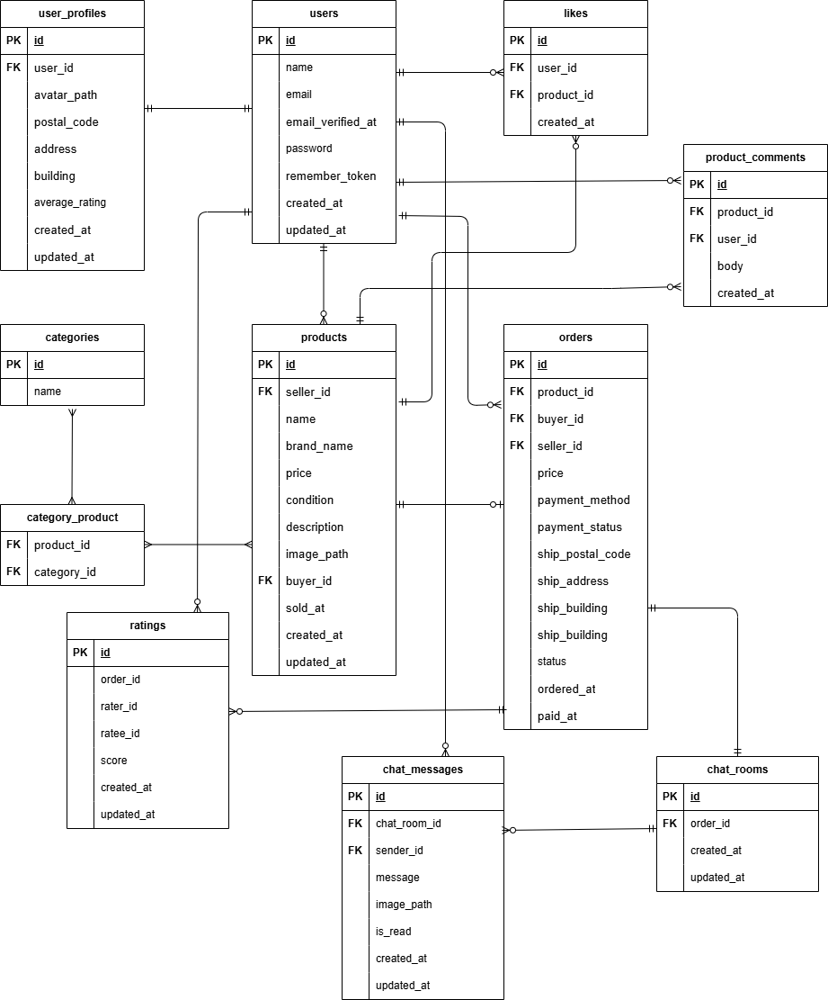

# フリマアプリ（Proテスト）
## 概要
本リポジトリは、COACHTECH Pro入会テスト「フリマアプリ（追加機能実装）」として提出した成果物です。  
模擬案件にて開発した「フリマアプリ」に、要件定義に基づき、取引チャット・ユーザー評価機能などを追加実装しています。  
README以外、提出当時の状態になっています。  
（実装期間：2025/10/31～2025/11/06

## 環境構築

### Docker ビルド

1. Docker を起動する
2. `git clone git@github.com:seki0603/flea-market-protest.git`
3. cd flea-market-protest
4. mkdir docker/mysql/data
5. docker-compose up -d --build

＊MySQL は、OS によって起動しない場合があるのでそれぞれの PC に合わせて docker-compose.yml ファイルを編集してください。
<br>

### Laravel 環境構築

1. docker-compose exec php bash
2. composer install
3. cp .env.example .env
4. php artisan key:generate
5. php artisan migrate
6. php artisan storage:link
7. chmod -R 777 storage bootstrap/cache
8. php artisan db:seed

- .env.example の値はダミー値です。そのまま利用可能ですが、必要に応じて.env で設定し直してください。
  <br>

## 動作確認について

デフォルトでは下記の通りダミーデータが投入されます。

- ユーザー 3 名
- 各ユーザーのプロフィール情報（初期状態では評価なし）
- 要件にて指定の商品 10 点
  - ユーザー 1：商品 ID 1~5 を出品
  - ユーザ 2：商品 ID 6~10 を出品
  - ユーザ 1：ユーザー 2 の出品から 2 点購入
  - ユーザー 2：ユーザー 1 の出品から 2 点購入
  * ユーザー 3：未取引
    <br><br>

そのため、今回追加した機能から動作確認が可能です。  
ログイン情報は下記の通りです。

```
Email: test{$index}@example.com
Password: password123
※{$index}には1 ~ 3の数字が入ります。
```

<br>

要件指定のダミーデータのみで、購入機能から確認される場合は、DatabaseSeeder.php の`ProOrdersSeeder::class`をコメントアウトしてからシーディングを実行し、.env に Stripe 接続キーを設定してください。
<br>

## Stripe(決済機能)について

模擬案件実装時、 Stripe のサンドボックス環境を利用して決済機能を導入しています。
必要に応じて.env テスト用接続キーを設定してください。

```
STRIPE_KEY="パブリックキー"
STRIPE_SECRET="シークレットキー"
```

<br>

以下のリンクは公式ドキュメントです。  
https://docs.stripe.com/payments/checkout?locale=ja-JP

カード支払いでは Stripe テスト用カード情報を利用可能です。

```
カード番号 : 4242 4242 4242 4242
有効期限 : 未来の月/年　（例: 12/30）
CVC : 任意の3桁の数字　（例: 123）
```

<br>

## 取引完了通知メールについて

MailHog を使用して実装しています。
取引完了後、 以下の URL にて受信確認可能です。

- MailHog : http://localhost:8025/

## 使用技術

- PHP 8.1.3
- Laravel 8.83.29
- MySQL 8.0.26
- nginx 1.21.1
  <br>

## ER 図



## 補足事項

### ヘッダー部検索欄について

模擬案件実装時、案件シート上では検索ボタン押下操作が指定されていた一方、Figma では入力欄のみがデザインされていました。
そのため、要件意図を優先して検索ボタンを実装しています。

<br>

### チャット・ユーザー評価・通知メール機能について

JavaScript 非依存による、可読性・保守性・生産性の向上を目的として、Laravel Livewire を用いて実装しています。

<br>

### 送信済みチャット更新機能について

案件シート上でユーザーの動作指定が無く、Figma のデザイン上も「編集」ボタンのみ表示されていたことから、以下の動作で更新できるよう実装しています。

1. 「編集」ボタン押下
2. 送信済みチャット編集
3. 「保存」ボタン押下
   <br>

### テストについて

案件シートにてテストケース指定が無かったため、追加実装は行っていません。
既存機能については引き続きテスト実行可能です。

#### テスト実行方法

.env.testing に Stripe 接続キーを設定し、プロジェクトディレクトリ直下で実行してください。

1. docker-compose exec mysql bash
2. mysql -u root -p
3. パスワードは root と入力
4. CREATE DATABASE laravel_test;
5. MySQL コンテナから抜ける
6. docker-compose exec php bash
7. php artisan migrate --env=testing
8. vendor/bin/phpunit
   <br>

## URL

- 開発環境：http://localhost/
- phpMyAdmin：http://localhost:8080/
- MailHog : http://localhost:8025/
- 案件シート : https://docs.google.com/spreadsheets/d/1AFiW_FhK4WJRihzImjOC8EX3l_x-bAOl7pME1whRZEk/edit?gid=2095977984#gid=2095977984
